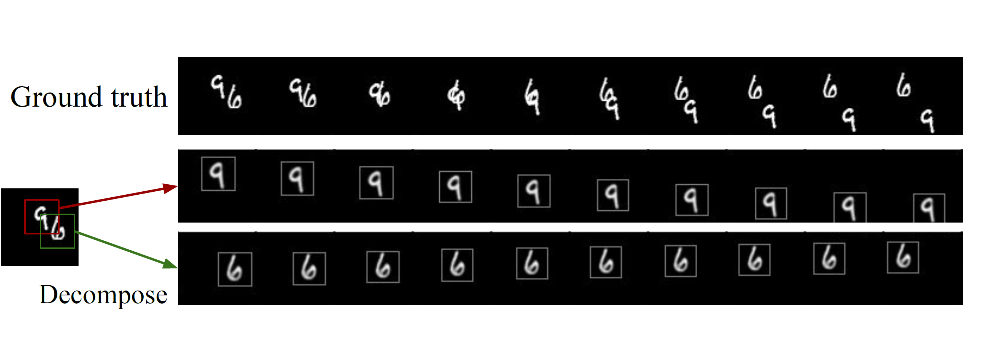

# DDPAE

This is the code for the paper

**<a href="https://arxiv.org/abs/1806.04166">Learning to Decompose and Disentangle Representations for Video Prediction</a>**
<br>
[Jun-Ting Hsieh](https://jthsieh.github.io/), [Bingbin Liu](https://clarabing.github.io/), [De-An Huang](http://ai.stanford.edu/~dahuang/), [Li Fei-Fei](http://vision.stanford.edu/feifeili/), [Juan Carlos Niebles](http://www.niebles.net/)

Will be presented at [NeurIPS 2018](https://nips.cc/).



Our goal is to predict future video frames given a sequence of input frames.
Our key insight into this high-dimensional prediction problem is to decompose it into sub-problems that can be more easily predicted.
To this end, we proposed the **Decompositional Disentangled Predictive Auto-Encoder (DDPAE)**, a framework that combines structured probabilistic models and deep networks to automatically
1. decompose the high-dimensional video into components, and 
2. disentangle each component to have low-dimensional temporal dynamics that are easier to predict.

Our DDPAE is able to learn both the latent decomposition and disentanglement without explicit supervision.
We show strong results on the Moving MNIST and Bouncing Balls datasets.

**Note:** Our code is built with [Pyro](http://pyro.ai/). We encourage readers to read the [Pyro tutorial](http://pyro.ai/examples/intro_part_i.html) and [AIR tutorial](http://pyro.ai/examples/air.html) to better understand our code.


If you find this code useful in your research then please cite:
```
@inproceedings{hsieh2018learning,
  title={Learning to Decompose and Disentangle Representations for Video Prediction},
  author={Hsieh, Jun-Ting and Liu, Bingbin and Huang, De-An and Fei-Fei, Li and Niebles, Juan Carlos},
  booktitle={NeurIPS},
  year={2018}
}
```

## Setup
All code was developed and tested on Python 3.6, PyTorch 0.3.1, and Pyro 0.2.
<br>
To view results, you need to install `tensorflow` and [tensorbaordX](https://github.com/lanpa/tensorboardX).


## Datasets

### Moving MNIST
Download the original [MNIST](http://yann.lecun.com/exdb/mnist/) dataset and the [Moving MNIST test set](http://www.cs.toronto.edu/~nitish/unsupervised_video/) by running
```
./datasets/moving_mnist/download.sh
```

### Bouncing Balls
We generate our Bouncing Balls dataset with the [Neural Physics Engine](https://github.com/mbchang/dynamics), used by Chang et al, 2017.

First, clone the [bouncing_balls](https://github.com/jthsieh/dynamics) submodule,
```
git submodule update --init --recursive
```
Note that this is slightly modified from the original [dynamics](https://github.com/mbchang/dynamics) repository.

`npm` must be installed. With Anaconda, install by running: `conda install -c conda-forge nodejs`.
Then,
```
cd datasets/bouncing_balls/src/js/
npm install
```

Generate training and testing data,
```
node demo/js/generate.js -e balls -n 4 -t 60 -s 50000
node demo/js/generate.js -e balls -n 4 -t 60 -s 2000
```

This will generate two folders, `balls_n4_t60_ex50000` and `balls_n4_t60_ex2000`, in the `datasets/bouncing_balls/data/` directory.
Move these folders to the desired location (dataset path).
Next, modify the `root` variable in `datasets/bouncing_balls/process.py` and run `python datasets/bouncing_balls/process.py` for both files.


## Training

Remember to set the arguments, such as `ckpt_dir`, `ckpt_name`, etc.
A `tb_train` directory will be created in `ckpt_dir`. You can see the training progress by running `tensorboard --logdir ckpt_dir/tb_train`.


### Moving MNIST
Run
```
./scripts/train_mnist.sh
```
In our paper, we let the model train for 200k iterations. However, 50k iterations should be enough to see the model separating the two digits.

### Moving MNIST
Run
```
./scripts/train_balls.sh
```
We also train for 200k iterations.
